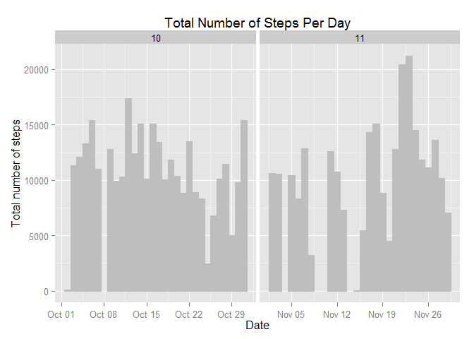
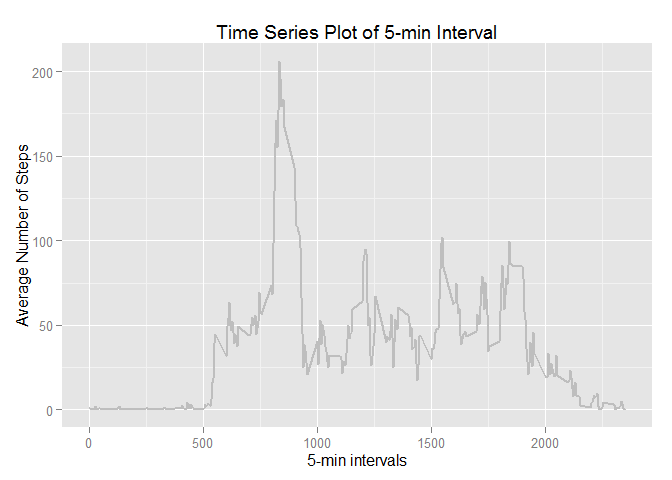
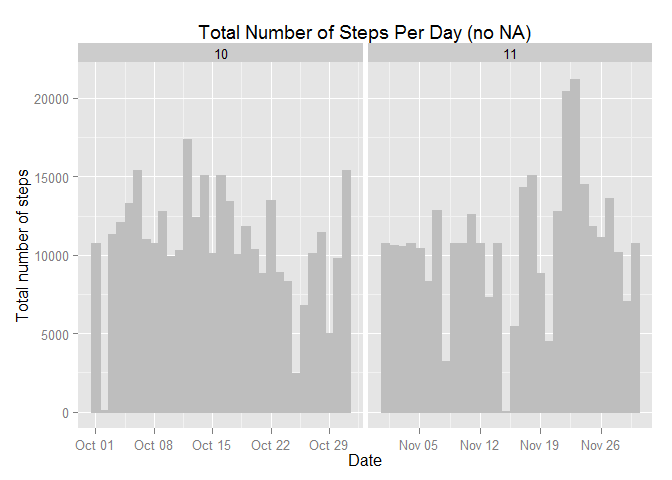

# Reproducible Research: Peer Assessment 1

### Global settings

```r
echo = TRUE
library(ggplot2)
library(lattice)
```

### Loading and processing the data

```r
unzip("activity.zip")
raw_data <- read.csv("activity.csv", colClasses = c("integer", "Date", "factor"))
raw_data$month <- as.numeric(format(raw_data$date, "%m"))
stripNA <- na.omit(raw_data)
rownames(stripNA) <- 1:nrow(stripNA)
summary(stripNA)
```

```
##      steps             date               interval         month      
##  Min.   :  0.00   Min.   :2012-10-02   0      :   53   Min.   :10.00  
##  1st Qu.:  0.00   1st Qu.:2012-10-16   10     :   53   1st Qu.:10.00  
##  Median :  0.00   Median :2012-10-29   100    :   53   Median :10.00  
##  Mean   : 37.38   Mean   :2012-10-30   1000   :   53   Mean   :10.45  
##  3rd Qu.: 12.00   3rd Qu.:2012-11-16   1005   :   53   3rd Qu.:11.00  
##  Max.   :806.00   Max.   :2012-11-29   1010   :   53   Max.   :11.00  
##                                        (Other):14946
```

```r
str(stripNA)
```

```
## 'data.frame':	15264 obs. of  4 variables:
##  $ steps   : int  0 0 0 0 0 0 0 0 0 0 ...
##  $ date    : Date, format: "2012-10-02" "2012-10-02" ...
##  $ interval: Factor w/ 288 levels "0","10","100",..: 1 226 2 73 136 195 198 209 212 223 ...
##  $ month   : num  10 10 10 10 10 10 10 10 10 10 ...
##  - attr(*, "na.action")=Class 'omit'  Named int [1:2304] 1 2 3 4 5 6 7 8 9 10 ...
##   .. ..- attr(*, "names")= chr [1:2304] "1" "2" "3" "4" ...
```

```r
head(stripNA)
```

```
##   steps       date interval month
## 1     0 2012-10-02        0    10
## 2     0 2012-10-02        5    10
## 3     0 2012-10-02       10    10
## 4     0 2012-10-02       15    10
## 5     0 2012-10-02       20    10
## 6     0 2012-10-02       25    10
```

```r
dim(stripNA)
```

```
## [1] 15264     4
```

### What is mean total number of steps taken per day?
For this part of the assignment, you can ignore the missing values in the dataset.

* Make a histogram of the total number of steps taken each day

```r
ggplot(stripNA, aes(date, steps)) + geom_bar(stat = "identity", colour = "grey", fill = "grey", width = 1) + facet_grid(. ~ month, scales = "free") + labs(title = "Total Number of Steps Per Day", x = "Date", y = "Total number of steps")
```

 

* Calculate and report the mean and median total number of steps taken per day

Mean total number of steps per day:

```r
totalSteps <- aggregate(stripNA$steps, list(Date = stripNA$date), FUN = "sum")$x
mean(totalSteps)
```

```
## [1] 10766.19
```
Median total number of steps per day:

```r
median(totalSteps)
```

```
## [1] 10765
```

### What is the average daily activity pattern?
* Make a time series plot (i.e. type = "l") of the 5-minute interval (x-axis) and the average number of steps taken, averaged across all days (y-axis)


```r
avgSteps <- aggregate(stripNA$steps, list(interval = as.numeric(as.character(stripNA$interval))), FUN = "mean")
names(avgSteps)[2] <- "meanSteps"

ggplot(avgSteps, aes(interval, meanSteps)) + geom_line(color = "grey", size = 1) + labs(title = "Time Series Plot of 5-min Interval", x = "5-min intervals", y = "Average Number of Steps")
```

 

* Which 5-minute interval, on average across all the days in the dataset, contains the maximum number of steps?

```r
avgSteps[avgSteps$meanSteps == max(avgSteps$meanSteps), ]
```

```
##     interval meanSteps
## 104      835  206.1698
```

### Imputing missing values
* The total number of rows with NAs:


```r
sum(is.na(raw_data))
```

```
## [1] 2304
```

* Devise a strategy for filling in all of the missing values in the dataset. The strategy does not need to be sophisticated. For example, you could use the mean/median for that day, or the mean for that 5-minute interval, etc.

Use mean for 5-min interval to fill missing NA values.

* Create a new dataset that is equal to the original dataset but with the missing data filled in.


```r
cleanData <- raw_data 
for (i in 1:nrow(cleanData)) {
    if (is.na(cleanData$steps[i])) {
        cleanData$steps[i] <- avgSteps[which(cleanData$interval[i] == avgSteps$interval), ]$meanSteps
    }
}

head(cleanData)
```

```
##       steps       date interval month
## 1 1.7169811 2012-10-01        0    10
## 2 0.3396226 2012-10-01        5    10
## 3 0.1320755 2012-10-01       10    10
## 4 0.1509434 2012-10-01       15    10
## 5 0.0754717 2012-10-01       20    10
## 6 2.0943396 2012-10-01       25    10
```

```r
sum(is.na(cleanData))
```

```
## [1] 0
```

* Make a histogram of the total number of steps taken each day and Calculate and report the mean and median total number of steps taken per day. 


```r
ggplot(cleanData, aes(date, steps)) + geom_bar(stat = "identity", colour = "grey", fill = "grey", width = 1) + facet_grid(. ~ month, scales = "free") + labs(title = "Total Number of Steps Per Day (no NA)", x = "Date", y = "Total number of steps")
```

 

* Do these values differ from the estimates from the first part of the assignment? What is the impact of imputing missing data on the estimates of the total daily number of steps?

Mean total number of steps per day:

```r
newTotalSteps <- aggregate(cleanData$steps, list(Date = cleanData$date), FUN = "sum")$x
newMean <- mean(newTotalSteps)
newMean
```

```
## [1] 10766.19
```

Median total number of steps per day:

```r
newMedian <- median(newTotalSteps)
newMedian
```

```
## [1] 10766.19
```

Compare them with the two before imputing missing data:

```r
oldMean <- mean(totalSteps)
oldMedian <- median(totalSteps)
```

Difference between new and old mean of total steps taken per day:

```r
newMean - oldMean
```

```
## [1] 0
```

Difference between new and old median of total steps taken per day:

```r
newMedian - oldMedian
```

```
## [1] 1.188679
```

After imputing the missing data:

* the new mean of total steps taken per day is the same as that of the old mean

* the new median of total steps taken per day is greater than that of the old median

### Are there differences in activity patterns between weekdays and weekends?

* Create a new factor variable in the dataset with two levels -- "weekday" and "weekend" indicating whether a given date is a weekday or weekend day.


```r
head(cleanData)
```

```
##       steps       date interval month
## 1 1.7169811 2012-10-01        0    10
## 2 0.3396226 2012-10-01        5    10
## 3 0.1320755 2012-10-01       10    10
## 4 0.1509434 2012-10-01       15    10
## 5 0.0754717 2012-10-01       20    10
## 6 2.0943396 2012-10-01       25    10
```

```r
cleanData$weekdays <- factor(format(cleanData$date, "%A"))
levels(cleanData$weekdays)
```

```
## [1] "Friday"    "Monday"    "Saturday"  "Sunday"    "Thursday"  "Tuesday"  
## [7] "Wednesday"
```

```r
levels(cleanData$weekdays) <- list(weekday = c("Monday", "Tuesday", "Wednesday", "Thursday", "Friday"), weekend = c("Saturday", "Sunday"))
levels(cleanData$weekdays)
```

```
## [1] "weekday" "weekend"
```

```r
table(cleanData$weekdays)
```

```
## 
## weekday weekend 
##   12960    4608
```

* Make a panel plot containing a time series plot (i.e. type = "l") of the 5-minute interval (x-axis) and the average number of steps taken, averaged across all weekday days or weekend days (y-axis).


```r
avgSteps <- aggregate(cleanData$steps, list(interval = as.numeric(as.character(cleanData$interval)), weekdays = cleanData$weekdays), FUN = "mean")
names(avgSteps)[3] <- "meanSteps"
xyplot(avgSteps$meanSteps ~ avgSteps$interval | avgSteps$weekdays, layout = c(1, 2), type = "l", xlab = "Interval", ylab = "Number of steps")
```

 
